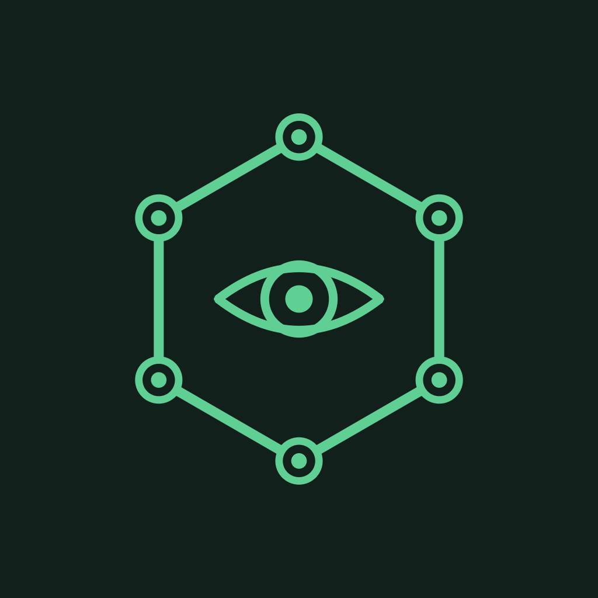
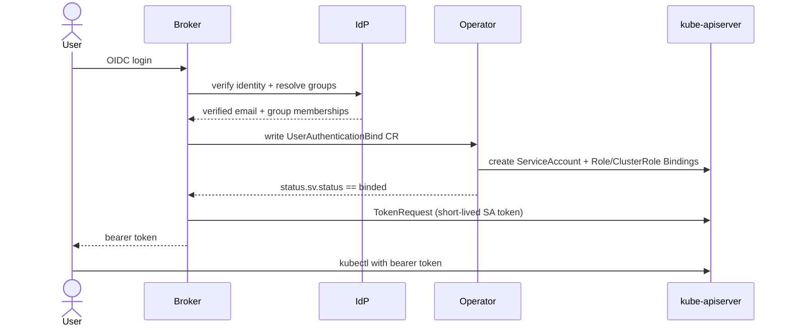

<div align="center">



# Kargus

**Drive Kubernetes RBAC from your identity provider's group membership.**

[](LICENSE)


</div>

---

Users log in through an OIDC identity provider; the broker exchanges their verified identity (plus group memberships) for a short-lived Kubernetes ServiceAccount token, with access gated by the operator's `UserAuthenticationBind` reconciliation.

## Components

| Path | What it is |
| --- | --- |
| `operator/` | Kubebuilder operator: the `UserAuthenticationBind` API (`kargus.io/v1`) + controller |
| `service/` | Auth broker: OAuth2/OIDC authorization-code flow to clients, Relying Party to the IdP |
| `chart/` | Helm umbrella chart (operator + broker + CRD) |
| `docs/` | Documentation site (Docusaurus) |

- **Go modules:** `github.com/kube-argus/kargus/operator` and `github.com/kube-argus/kargus/service` (tied by a root `go.work`).
- **Default namespace:** `kargus-system` · **API group:** `kargus.io`

## How it works



1. Cluster operators tag `Role`s / `ClusterRole`s they want to expose with the annotation `rbac.kargus.io/group: <group-id>`.
2. A user authenticates via the broker → IdP (OIDC). The broker validates the identity (verified email, allowed domain) and resolves group memberships.
3. The broker writes a `UserAuthenticationBind` CR with those memberships and waits for `status.sv.status == binded`.
4. The operator reconciles the CR: creates a per-user `ServiceAccount` and binds it (via `RoleBinding`/`ClusterRoleBinding`) to every annotated role whose group is in the user's memberships. Membership changes re-sync; binds expire after their TTL.
5. The broker mints a short-lived SA token (`TokenRequest`) and returns it to the client, which uses it as a bearer credential against the kube-apiserver.

## Identity providers

The broker accepts any external IdP capable of OIDC login + group resolution (`IDP_TYPE`):
- `oidc` — generic OpenID Connect issuer (Keycloak, Okta, Entra, Authentik, Dex); groups read from a configurable ID-token claim.
- `google` — Google Workspace; groups via the Admin SDK Directory API.

## Install

```bash
helm install Kargus ./chart \
  --namespace kargus-system --create-namespace \
  --set idp... --set broker.config...
```

See `docs/` (Installation, Helm chart, Broker service, CRD reference) for full configuration.

## Development

```bash
# build both modules via the workspace
go build github.com/kube-argus/kargus/operator/... github.com/kube-argus/kargus/service/...

# operator
cd operator && make manifests generate && go test ./internal/controller/...

# broker
cd service && go test ./...

# chart
helm lint chart/

# docs
cd docs && npm install && npm start
```

## License

[GNU AGPLv3](LICENSE)