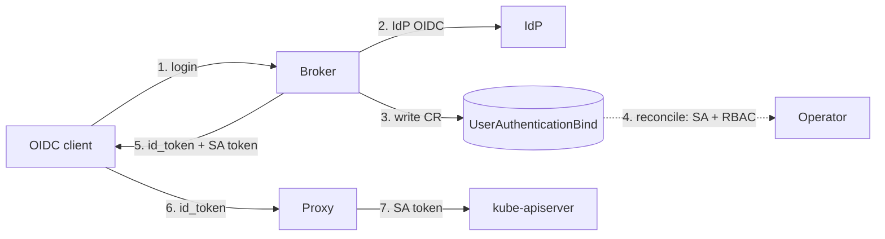

# Architecture

## Components

- **`UserAuthenticationBind` CRD** (`kargus.io/v1`) — the desired state: a user,
  their domain, a TTL, and the IdP group memberships.
- **Controller** (`internal/controller`) — reconciles each `UserAuthenticationBind`
  into concrete Kubernetes RBAC objects.
- **Broker** (`service/cmd/server`) — the OIDC provider; on login it writes the
  CR, waits for the bind, mints the SA token, and signs an id_token.
- **Proxy** (`service/cmd/proxy`) — fronts the kube-apiserver and swaps the
  broker id_token for the user's SA token (no apiserver OIDC config required).

## End-to-end auth flow



The broker handles *login* and provisioning; the proxy handles every subsequent
*API call*. RBAC is always carried by the per-user ServiceAccount, so it behaves
identically on any cluster.

## The binding model

Access is *discovered*, not enumerated in the CR. The operator never hard-codes
which roles exist. Instead:

1. A cluster operator annotates any `Role` or `ClusterRole` that should be
   group-gated:

   ```yaml
   apiVersion: rbac.authorization.k8s.io/v1
   kind: ClusterRole
   metadata:
     name: cluster-readonly
     annotations:
       rbac.kargus.io/group: <gid or name>
   rules: [...]
   ```

2. A `UserAuthenticationBind` lists the groups the user belongs to:

   ```yaml
   spec:
     user: admin
     memberships:
       - gid: gid-21ed34ef
         name: network-admin
         domain: kargus.io
   ```

3. The operator binds the user's `ServiceAccount` to every annotated role whose
   `rbac.kargus.io/group` value appears in `spec.memberships[].gid`.

The match key is **`gid`** — the stable group identifier from the IdP.

## Objects the operator owns

| Object | Scope | Created when | Cleanup |
| --- | --- | --- | --- |
| `ServiceAccount` | CR namespace | always (named after `spec.user`) | owner reference → garbage collected |
| `ClusterRoleBinding` | cluster | per matching `ClusterRole` | label + finalizer |
| `RoleBinding` | role's namespace | per matching `Role` | label + finalizer |

Every binding carries the label `kargus.io/owned-by: <cr-uid>` and a
deterministic name `kargus-<cr-uid>-<role>`, which makes creation idempotent and
cleanup a simple label query.

:::note Why not owner references for bindings?
A `ClusterRoleBinding` is cluster-scoped and a `RoleBinding` may live in a
different namespace than the CR. Kubernetes forbids a namespaced object from
owning cross-scope or cross-namespace objects, so the operator cleans those up
with a **finalizer + label query** instead of relying on garbage collection. The
`ServiceAccount` lives in the CR namespace, so it *does* use an owner reference.
:::

## Status and lifecycle

`status.sv.status` tracks the bind phase:

`pending` → `binding` → `binded`, with `failed` on error and `unbound` once the
TTL elapses. A standard `Ready` condition mirrors the phase. See the
[reconcile flow](./reconcile-flow.md) for the full state machine.
