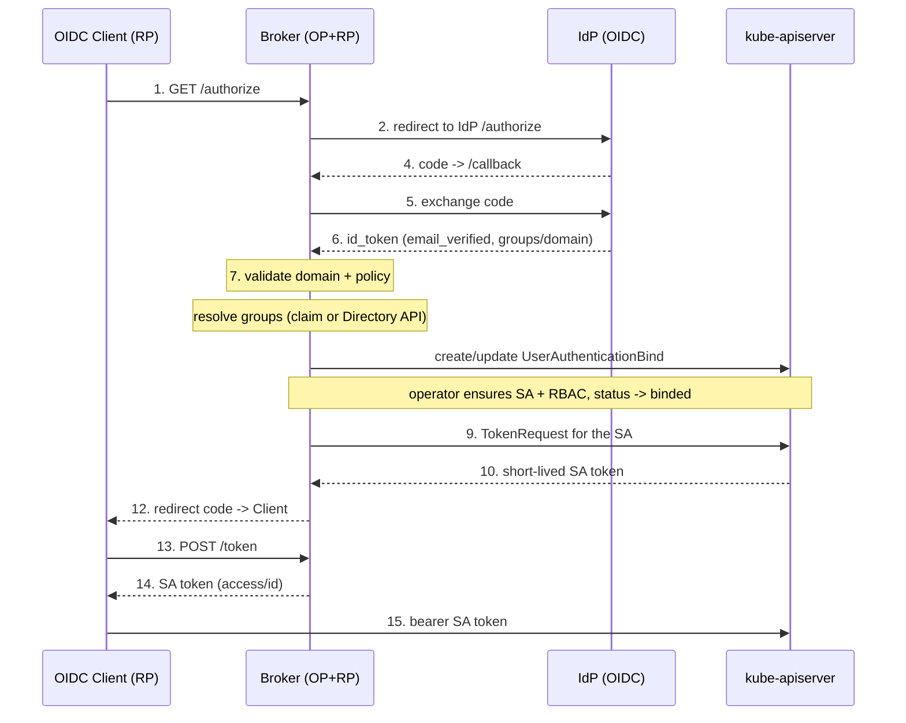

# Broker Service

The broker (`service/`) is a Go HTTP server that speaks the **OAuth2 /
OpenID Connect authorization-code flow** to a client, and is a **Relying Party**
to an upstream identity provider. It exchanges a verified IdP identity for a
short-lived Kubernetes ServiceAccount token, gated by the operator's
`UserAuthenticationBind` reconciliation.

The IdP is pluggable behind the `idp.Provider` interface — any provider that can
do OIDC login **and** report group membership. Two implementations ship today:

- **`oidc`** — generic OIDC (Keycloak, Okta, Entra, Authentik, Dex, …); groups
  are read from a configurable ID-token claim (`IDP_GROUPS_CLAIM`, default
  `groups`).
- **`google`** — Google Workspace; groups come from the Admin SDK Directory API
  and the domain is the `hd` claim. See
  [Configuring the Google Workspace IdP](./idp-google.md).

## Token model (important)

`/token` returns **two different tokens**:

- **`id_token`** — a JWT **signed by the broker** (RS256), with `iss` = the
  broker issuer, `aud` = the client, plus `sub`/`email`/`name`/`groups`/`nonce`.
  The client verifies this against the broker's `jwks_uri`. Public keys are at
  `/jwks`.
- **`access_token`** — the **cluster-signed ServiceAccount token** (via
  `TokenRequest`), issuer `https://kubernetes.default.svc…`. This is the bearer
  the **kube-apiserver** accepts.

:::note How the SA token reaches the cluster
The `id_token` is what the **client verifies and forwards** (its `iss` is the
broker). It is not directly valid against the kube-apiserver. The
[cluster auth proxy](./proxy.md) sits in front of the apiserver, verifies the
id_token, and swaps it for the `access_token` (the SA token) — which the
apiserver accepts natively. So the client only deals with the broker id_token;
the proxy handles the SA token. This avoids configuring the apiserver for OIDC
and works on any cluster.
:::

## Flow



The broker does **not** create the ServiceAccount or RBAC itself — it writes the
CR and waits for `status.sv.status == binded`; the operator owns that work.

## Endpoints

| Method | Path | Role |
| --- | --- | --- |
| GET | `/.well-known/openid-configuration` | OIDC discovery |
| GET | `/jwks` | id_token signing public keys (JWKS) |
| GET | `/authorize` | start login (client → broker) |
| GET | `/callback` | IdP redirect; runs the bind + mint |
| POST | `/token` | `authorization_code` → tokens; `refresh_token` → rotated tokens |
| GET | `/healthz` | liveness/readiness |

## Security model

- **PKCE (S256) mandatory** on the client ↔ broker leg.
- `redirect_uri` is **exact-match** allowlisted; the broker never redirects to an
  unverified URI.
- Identities must have `email_verified: true` and a domain in `ALLOWED_DOMAINS`
  (the `hd` claim for Google, the email domain for generic OIDC).
- The IdP `nonce` is verified on callback (replay protection).
- Authorization codes are **one-shot** (atomic `GETDEL` on Redis, delete-on-read
  in memory) and short-lived.
- The `access_token` is minted by the kube-apiserver (`TokenRequest`),
  short-lived and audience-scoped.
- The `id_token` is signed by the broker with an RSA key (`ID_TOKEN_SIGNING_KEY`).
  Provide a stable key in production — an unset key is generated per-process, so
  it breaks across replicas and restarts.

## Configuration

All configuration is environment-driven (see `internal/config`).

| Var | Default | Notes |
| --- | --- | --- |
| `ISSUER` | — | broker public URL (required) |
| `IDP_TYPE` | `oidc` | `oidc` (generic) \| `google` |
| `IDP_ISSUER` | — | IdP issuer URL (required; auto-set for `google`) |
| `IDP_CLIENT_ID` / `IDP_CLIENT_SECRET` | — | OAuth client at the IdP (required) |
| `IDP_REDIRECT_URL` | — | broker `/callback`, registered with the IdP (required) |
| `IDP_SCOPES` | `openid,email,profile` | request `groups` too for the generic provider |
| `IDP_GROUPS_CLAIM` | `groups` | generic OIDC: ID-token claim holding group ids |
| `GOOGLE_DELEGATED_ADMIN` | — | required when `IDP_TYPE=google` |
| `GOOGLE_CREDENTIALS_FILE` | — | google: service-account JSON (else ADC) |
| `ALLOWED_DOMAINS` | — | CSV of allowed domains (required) |
| `CLIENT_ID` | — | the OIDC client's id (required) |
| `CLIENT_SECRET` | — | optional; empty = public client (PKCE only) |
| `REDIRECT_URIS` | — | CSV of allowed client redirect URIs (required) |
| `ID_TOKEN_SIGNING_KEY` | — | RSA private key (PEM) for signing id_tokens; generated ephemerally if unset (dev only) |
| `TOKEN_LIFETIME_SECONDS` | `900` | id_token + SA token lifetime |
| `REFRESH_TOKEN_LIFETIME_SECONDS` | = `BIND_TTL` | session length; defaults to `BIND_TTL` so the session and the bind share one sliding window |
| `TLS_CERT_FILE` / `TLS_KEY_FILE` | — | when both set, the broker serves HTTPS directly; empty = plain HTTP (TLS at the ingress) |
| `TOKEN_AUDIENCES` | — (empty) | SA token audiences; empty = apiserver default audience (natively accepted). Set only if the token is consumed elsewhere |
| `BIND_NAMESPACE` | `kargus-system` | namespace for CRs + SAs |
| `BIND_TTL` | `12h` | `spec.ttl` written on the CR |
| `SESSION_STORE` | `memory` | `memory` \| `redis` |
| `REDIS_ADDR` / `REDIS_PASSWORD` / `REDIS_DB` / `REDIS_TLS` | — | required when redis |

:::note Generic OIDC groups
The generic provider reads groups from the ID token, so the IdP must be
configured to emit them (often a `groups` scope/claim mapper). Group membership
fetched from a separate API/SCIM is not supported yet.
:::

### Sessions / refresh tokens

The SA token is short-lived, so `/token` also returns a **`refresh_token`**. The
client exchanges it (`grant_type=refresh_token`) for a fresh SA token + id_token
without another IdP round-trip. On refresh the broker **re-binds** the user (CR
upsert + wait) and **rotates** the refresh token (the old one is single-use).

This keeps OIDC clients (e.g. Headlamp) logged in past the access-token lifetime
— without it, the client repeatedly fails to refresh once the token expires.
Group membership is snapshotted at login; it re-resolves on the next full login.

The refresh-token lifetime defaults to `BIND_TTL`, so the **session and the
`UserAuthenticationBind` share one sliding window**: each refresh (and each
login) re-stamps the CR's `kargus.io/renewed-at` annotation, which the operator
uses as the TTL anchor — renewing the bind. Stop refreshing and both expire
together after `BIND_TTL`. Keep `TOKEN_LIFETIME_SECONDS` shorter than `BIND_TTL`
so the client refreshes (and renews) within the window.

### High availability

Set `SESSION_STORE=redis` and scale replicas. Codes/auth-requests then live in
Redis (atomic one-shot reads), so any replica can complete any leg of the flow —
no sticky sessions.

## Build, run, deploy

```bash
make (build | push | release) REPOSITORY=ghcr.io/kube-argus/kargus VERSION=v0.2.1
```

## Module layout

| Path | Purpose |
| --- | --- |
| `cmd/server/main.go` | wiring + graceful shutdown |
| `internal/config` | env config + validation |
| `internal/store` | auth-request/code store (`memory` \| `redis`) |
| `internal/idp` | `Provider` interface + factory |
| `internal/idp/oidc` | generic OIDC provider (claim groups) |
| `internal/idp/google` | Google Workspace provider (Directory groups) |
| `internal/k8s` | CR upsert/wait + TokenRequest |
| `internal/broker` | OP handlers (authorize/callback/token/jwks) + id_token signer |
| `internal/server` | HTTP mux + middleware |
| `internal/proxy` | the [cluster auth proxy](./proxy.md) (`cmd/proxy`) |

The module reuses the operator's CR types via
`replace github.com/kube-argus/kube-argus/operator => ../operator`.
