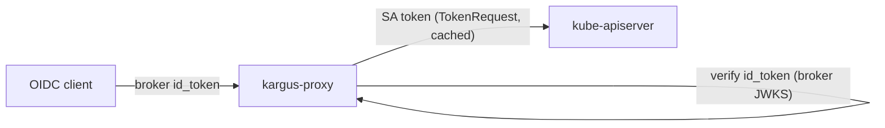

# Cluster Auth Proxy (`kargus-proxy`)

The proxy makes the SA-token model work with **any** Kubernetes cluster — GKE,
EKS, AKS, self-managed — **without configuring the apiserver**. It's a separate
component from the broker.

## Why it exists

A kube-apiserver accepts a **ServiceAccount token** natively (no flags). But OIDC
clients (e.g. Headlamp) verify the issuer of whatever token they forward, and an
SA token's issuer is the *cluster*, not the broker — so a client can't send the
SA token directly. Configuring the apiserver for OIDC (`--oidc-issuer-url`) isn't
possible on managed clusters. The proxy bridges the two:



Point the client's **cluster endpoint at the proxy**. Per request the proxy:
1. verifies the bearer is a broker-issued `id_token` (signature/`iss`/`aud`),
2. maps the `email` claim → the user's ServiceAccount, mints a short-lived SA
   token (`TokenRequest`, cached per user),
3. rewrites `Authorization` to the SA token and forwards to the apiserver
   (in-cluster CA), streaming `logs -f` / `exec` / `port-forward`.

RBAC is the operator's per-user SA bindings — so it works identically on every
cluster.

## Configuration

| Var | Default | Notes |
| --- | --- | --- |
| `ISSUER` | — | the broker's **public** URL; checked against the token `iss` (must match `broker.config.issuer`) |
| `JWKS_URL` | `ISSUER + /jwks` | where to fetch keys; the chart points it at the broker's **in-cluster** Service (no external DNS) |
| `CLIENT_ID` | — | expected `aud` of the id_token |
| `BIND_NAMESPACE` | `kargus-system` | namespace of the per-user SAs |
| `USERNAME_CLAIM` | `email` | id_token claim mapped to the SA name |
| `TOKEN_EXPIRATION_SECONDS` | `600` | minted SA token lifetime |
| `TLS_CERT_FILE` / `TLS_KEY_FILE` | — | serve HTTPS (recommended; the client treats the proxy as the apiserver) |

## Enable it (Helm)

```bash
helm upgrade kargus ./chart -n kargus-system --reuse-values \
  --set proxy.enabled=true \
  --set proxy.clientID=headlamp \
  --set proxy.tls.enabled=true \
  --set proxy.tls.secretName=kargus-proxy-tls
```

## TLS

By default (`proxy.tls.generate=true`) the chart **self-signs** a cert for the
proxy Service DNS names and stores it — with its CA — in a Secret, preserved
across upgrades. The client just needs to trust that CA:

```bash
kubectl -n kargus-system get secret kg-kargus-proxy-tls \
  -o jsonpath='{.data.ca\.crt}' | base64 -d > proxy-ca.pem
```

Set `proxy.tls.generate=false` + `proxy.tls.secretName=<secret>` to use
cert-manager or your own `kubernetes.io/tls` Secret instead.

## Pointing Headlamp at the proxy

Three changes in the Headlamp values:

1. **Repoint the apiserver** at the proxy Service:
   ```yaml
   env:
     - { name: KUBERNETES_SERVICE_HOST, value: "kargus-kargus-proxy.kargus-system.svc" }
     - { name: KUBERNETES_SERVICE_PORT, value: "443" }
   ```
2. `automountServiceAccountToken: false`
3. **Override the in-cluster CA** with the proxy CA via a projected volume:
   ```yaml
   volumeMounts:
     - { name: kube-api-access, mountPath: /var/run/secrets/kubernetes.io/serviceaccount, readOnly: true }
   volumes:
     - name: kube-api-access
       projected:
         sources:
           - serviceAccountToken: { path: token, expirationSeconds: 3600 }
           - downwardAPI: { items: [ { path: namespace, fieldRef: { fieldPath: metadata.namespace } } ] }
           - secret: { name: kargus-kargus-proxy-tls, items: [ { key: ca.crt, path: ca.crt } ] }
   ```

Keep `useAccessToken: false` — Headlamp verifies + forwards the **broker
id_token**, which the proxy swaps for the user's SA token. (The proxy passes
through any non-broker token unchanged, so Headlamp's own SA calls still work.)

:::caution Data path
All Kubernetes API traffic flows through the proxy — run enough replicas, and
note it mints/forwards SA tokens for every user, so keep the broker id_token
short-lived and the proxy locked down.
:::
