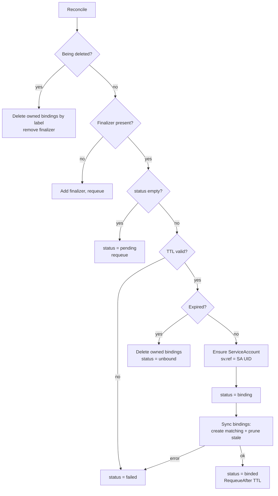

# Reconcile Flow

The controller's `Reconcile` runs on every create, update, and resync of a
`UserAuthenticationBind`. It always converges to the desired state, so it is safe
to run repeatedly.

## State machine

## Step by step

1. **Fetch** the CR. Not found → no-op (it was deleted).
2. **Deletion** — if `metadata.deletionTimestamp` is set, delete every binding
   labelled `kargus.io/owned-by=<uid>`, then remove the finalizer.
3. **Finalizer** — ensure `kargus.io/finalizer` is present (so cleanup runs on
   delete). Adding it requeues.
4. **Pending** — on first observation, set `status.sv.status = pending` and
   requeue, so the phase is observable before any work happens.
5. **TTL** — parse `spec.ttl`. Invalid → `failed`. Compute
   `expiry = anchor + ttl`, where `anchor` is the `kargus.io/renewed-at`
   annotation (stamped by the broker on each login) or `creationTimestamp` if
   absent. So a re-login renews an expired bind (sliding window).
6. **Expiry** — if past expiry, delete owned bindings and set `unbound`.
7. **ServiceAccount** — create/update the SA named `spec.user` in the CR
   namespace, owned by the CR. Record its UID in `status.sv.ref`.
8. **Binding (transient)** — set `status.sv.status = binding`.
9. **Sync** — the core reconcile-to-set:
   - Build the desired set: every annotated `ClusterRole`/`Role` whose
     `rbac.kargus.io/group` is in `spec.memberships[].gid`.
   - **Create** missing bindings (idempotent; `AlreadyExists` is ignored).
   - **Prune** any owned binding *not* in the desired set — this is what makes
     membership changes (and removed annotations / deleted roles) take effect.
10. **Result** — all good → `binded` + `Ready=True`, and requeue at `expiry` so
    the bind is unbound on time. Any error → `failed` + `Ready=False`.

## Phases

| Phase | Meaning |
| --- | --- |
| `pending` | Accepted, not yet synced |
| `binding` | Actively creating/pruning RBAC bindings (transient) |
| `binded` | All desired bindings in place |
| `unbound` | TTL elapsed; access revoked |
| `failed` | Could not apply (e.g. invalid TTL, API error) |
